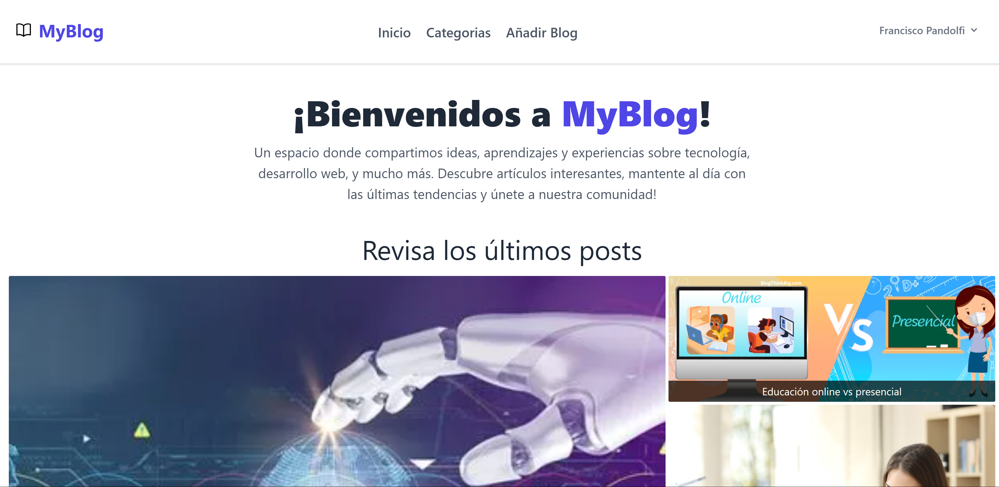

## ℹ️ Información del proyecto

**Nombre del proyecto: MyBlog** <br>
**Materia: Programacion Web Avanzada** <br>
**Profesor: Lidia López** <br>
**TP nº 3 Laravel**<br>

## 👥 Integrantes del grupo

- Pandolfi Francisco  FAI-4650
- Paredes Martín  FAI-4997
- Resler Leandro  FAI-4275

## 📌 Descripción de la aplicación

MyBlog es un espacio abierto donde los usuarios pueden compartir sus ideas y conocimientos sobre una variedad de temas como tecnología, deportes, salud, ciencia y más. Cada publicación está organizada por categorías, lo que facilita explorar contenido de interés. Los usuarios registrados pueden crear sus propios posts y participar activamente comentando en las publicaciones de otros.

## 🛠️ Instrucciones de instalación y ejecución

Siga estos pasos para clonar e instalar correctamente el proyecto en su entorno local.

**1. Abre una terminal y ejecuta el siguiente comando para clonar el repositorio:** 
```bash
    git clone https://github.com/FranciscoPJ/tp3-laravel
```
**2. Accede al directorio del proyecto:** 
```bash
    cd tp3-laravel/myblog
```

**3. Instala las dependencias del backend con Composer:** 
```bash
    composer install
``` 

**4. Instala las dependencias del frontend con npm:** 
```bash
    npm install
``` 

**5. Configura la Base de Datos:** 
```bash
    -DB_DATABASE=nombre_db 
    -DB_USERNAME=tu_usuario 
    -DB_PASSWORD=tu_contraseña 
``` 
**6. Corre las migraciones:** 
```bash
    php artisan migrate
``` 

**7. Inicia el servidor local:**
```bash
    php artisan serve
``` 

**8. Abre su navegador y accede a la URL que aparece en la consola:**
```bash
    http://127.0.0.1:8000
``` 

---
**1.En la imagen muestra el inicio de la pagina de MyBlog**


**2. La sección `<header>` contiene una barra de navegación (`<nav>`) que muestra el título del sitio, "MyBlog", y enlaces de navegación como "Inicio", "Categoría", "Iniciar Sesion" y "Registrarse". Estos enlaces que se muestran cuando el usuario no está autenticado.**


Cuando el usuario ha iniciado sesión, se agrega el enlace de navegación "Añadir Blog" y  "Iniciar Sesion" y "Registrarse" son reemplazado por un **menú de configuración** desplegable en la parte derecha de la barra de navegación. Este menú incluye:

- El nombre del usuario actualmente autenticado.
- Un enlace al perfil del usuario.
- Un botón para cerrar sesión, el cual se implementa mediante un formulario `POST` que envía la solicitud a la ruta `logout`, con protección CSRF incluida.


---